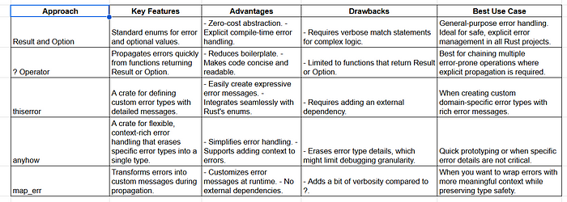

# Mastering Error Handling in Rust: Top 5 Quick and Optimized Techniques

> **Source: [Mastering Error Handling in Rust: Top 5 Quick and Optimized Techniques | by Ruben Lazarus - Freedium](https://freedium.cfd/https://medium.com/@robssthe/mastering-error-handling-in-rust-top-5-quick-and-optimized-techniques-1e45a51a9491)

Error handling is an essential part of programming, and Rust offers powerful tools to make error management safe and efficient. In this article, we'll explore the **top 5 ways to handle errors in Rust**, focusing on approaches that are quick, optimized, and suitable for different scenarios. We'll also compare these techniques in a table to help you choose the best option for your use case.

## 1. Using `Result` and `Option` Enums

Rust's standard enums, `Result<T, E>` and `Option<T>`, are the foundation of error handling. These enums let you represent success, failure, or optional values explicitly.

## Code Example:

```rust
fn divide(a: f64, b: f64) -> Result<f64, &'static str> {
    if b == 0.0 {
        Err("Division by zero error")
    } else {
        Ok(a / b)
    }
}

fn main() {
    match divide(10.0, 0.0) {
        Ok(result) => println!("Result: {}", result),
        Err(e)     => println!("Error: {}", e),
    }
}
```


## Why It Works:

- **Compile-time Safety:** Ensures all possible outcomes are handled.
- **No Overhead:** Minimal runtime cost.

## Best Use Case:

General-purpose error handling. Ideal for safe and explicit management of errors.

## 2. Using `?` Operator for Propagation

The `?` operator simplifies error propagation by automatically returning errors to the calling function.

## Code Example:

```rust
use std::fs::File;
use std::io::{self, Read};

fn read_file_contents(file_path: &str) -> Result<String, io::Error> {
    let mut file = File::open(file_path)?;
    let mut contents = String::new();
    file.read_to_string(&mut contents)?;
    Ok(contents)
}

fn main() -> Result<(), io::Error> {
    let contents = read_file_contents("example.txt")?;
    println!("{}", contents);
    Ok(())
}
```


## Why It Works:

- **Reduces Boilerplate:** No need for verbose `match` statements.
- **Readable Code:** Keeps the flow straightforward.

## Best Use Case:

Simplifying workflows with chained error-prone operations.

## 3. Using `thiserror` for Custom Error Types

The `thiserror` crate helps define concise custom error types, enhancing error messages and reducing repetitive code.

## Code Example:

```rust
use thiserror::Error;
#[derive(Error, Debug)]
enum MyError {
    #[error("File not found: {0}")]
    FileNotFound(String),
    #[error("Invalid input")]
    InvalidInput,
}

fn process_file(file_path: &str) -> Result<(), MyError> {
    if !file_path.ends_with(".txt") {
        return Err(MyError::InvalidInput);
    }
    Err(MyError::FileNotFound(file_path.to_string()))
}

fn main() {
    match process_file("example.rs") {
        Ok(_)  => println!("File processed successfully."),
        Err(e) => println!("Error: {}", e),
    }
}
```


## Why It Works:

- **Customizable Errors:** Clear and actionable error messages.
- **Integration:** Works seamlessly with the `?` operator.

## Best Use Case:

Creating robust error descriptions for domain-specific logic.

## 4. Using `anyhow` for Flexible Error Handling

The `anyhow` crate simplifies error handling when specific error types aren't crucial. It wraps errors into a single `anyhow::Error` type.

## Code Example:

```rust
use anyhow::{Context, Result}; fn risky_operation() -> Result<()> {
    let file_path = "example.txt";
    std::fs::read_to_string(file_path).context(format!("Failed to read file: {}", file_path))?;
    Ok(())
}

fn main() {
    if let Err(e) = risky_operation() {
        println!("Error: {}", e);
    }
}
```


## Why It Works:

- **Ease of Use:** No need to define custom error types.
- **Detailed Errors:** Provides context for better debugging.

## Best Use Case:

Prototyping or projects where detailed error types aren't critical.

## 5. Wrapping Errors with `map_err`

When you need to convert errors into more meaningful types, `map_err` allows custom mapping of errors.

## Code Example:

```rust
fn parse_number(input: &str) -> Result<i32, String> {
    input.parse::<i32>().map_err(|_| format!("Failed to parse '{}'", input))
}

fn main() {
    match parse_number("abc") {
        Ok(num) => println!("Parsed number: {}", num),
        Err(e)  => println!("Error: {}", e),
    }
}
```


## Why It Works:

- **Granular Control:** Customize error messages during propagation.
- **Lightweight:** No external dependencies.

## Best Use Case:

Adding meaningful context to errors during runtime.

## Comparison Table

Here's a quick comparison of the top 5 error-handling techniques:



## Conclusion

Rust's error-handling ecosystem is designed to balance **safety** and **performance**. Choosing the right approach depends on your specific use case:

- Use **`Result`** **and** **`Option`** for explicit and safe error management.
- The **`?`** **operator** simplifies workflows for chaining error-prone operations.
- Opt for **`thiserror`** or **`anyhow`** when dealing with complex or flexible error scenarios.
- Use **`map_err`** to enhance error messages while maintaining type safety.